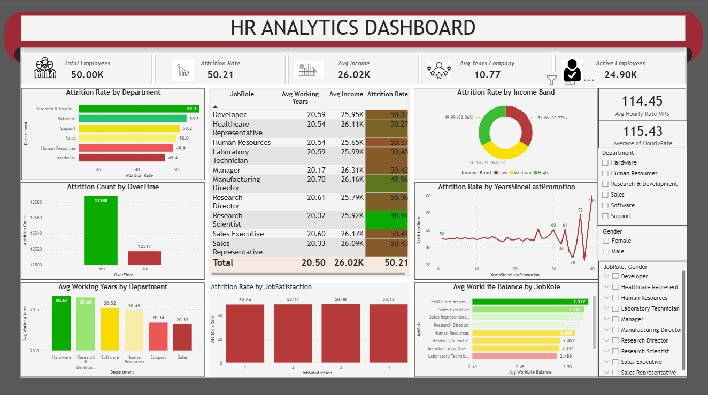

# HR Analytics Dashboard – Power BI

## Project Overview

Developed an interactive HR Analytics dashboard in Power BI to analyze employee data and identify workforce trends, employee demographics, and key HR performance indicators.

## Tools Used

* Power BI
* Power Query
* DAX
* Excel

## Key Analysis

* Employee headcount analysis
* Employee demographics
* Department-wise workforce analysis
* Gender distribution
* Employee attrition analysis
* Job role analysis
* Age and experience analysis
* HR KPI tracking

## Dashboard

The Power BI dashboard provides interactive visualizations and filters to explore employee trends and HR metrics across different categories.

## Project Files

* `HR Analytics.pbix` – Power BI dashboard file

## Key Skills Demonstrated

* Data Cleaning
* Data Transformation
* Data Modeling
* DAX
* Data Visualization
* KPI Analysis
* Interactive Dashboard Development
